# Lab Report #3: Week 6

## Streamlining ssh Configuration

 

- This first picture below is the .ssh/config file that I created in VSCode. The file was not previously created for me so I had to use the command `$null > config` in the terminal to create the file. Once the file was created for me, I typed in the Host, HostName, and User. 
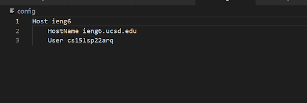

 

- This next screenshot show me using the alias "ieng6" that I created in the config file. Here you can see that just by using the command `ssh ieng6`, I am able to log in to my remote account. 
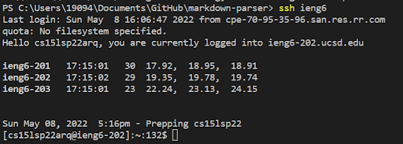

 

- In this screenshot, the `scp MarkdownParse.java ieng6:~/` command is used to copy the MarkdownParse java file over to the remote computer. The `ieng6:~/` is there so that the computer knows where to copy the file into. 
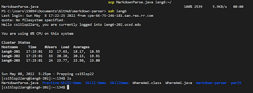

 

## Setting up Github Access from ieng6

 

- This is where my public key is stored in Github. I used `cat ~/.ssh/id_rsa.pub` to obtain the key information. After navigating to the SSH and GPG keys tab in the Github settings, I copy and pasted the key information and created a new SSH key. 
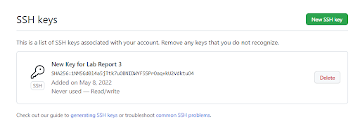

 

- This is where my private key is stored in the remote account. I used `ls -al ~/.ssh` command to access the key directory. Id_rsa is the private key.  
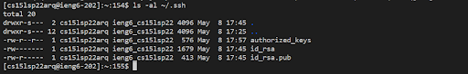

 

- First, I used `vim MarkdownParseTest.java` to access the file from the remote computer seen in the picture below. It is helpful to note that you cannot just edit this file normally. Here are a list of helpful commands: `i` (insert), `esc` (stop insert), and `:wq` (save and exit editor).
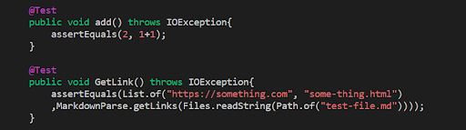

 

- In this case, I added a random add test method that asserts that 2 is equal to 2. The next step is to use `git add MarkdownParseTest.java` and `git commit -m "added test"` to commit the changes that were made. Here is also a [link](https://github.com/Yundukki/markdown-parser/commit/debff6e1161e5e3cf742f4f22819f0a011dc658b) to the commit in my Github repository. 
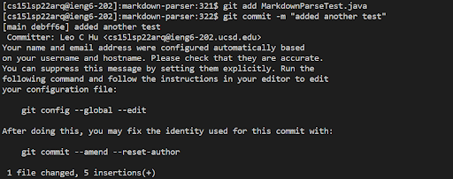

 

- Next, we need to push the commit to the origin so that changes can be made in the Github repository. For that we use the command `git push` and `git push origin main`. Below I have attached pictures of both commands being used. 
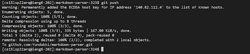
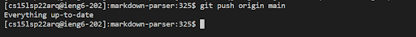

 

## Copying Entire Directories using scp -r

 

- For the first task of this part, I used command `scp -r . ieng6:markdown-parser` to copy the entire markdown-parser repository into my remote account. Below you can see all files in my Markdown-parser repository are copied at 100% into the remote account.
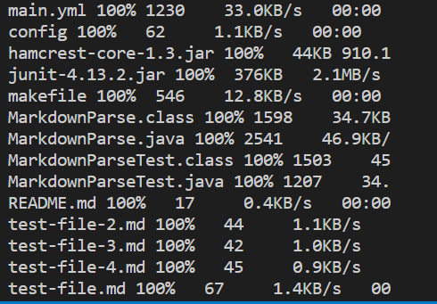

 

- Next, we log in to our remote account to test whether or not the files are properly copied over. To do that, we run the junit tests in our remote account. Remember to be in the correct directory (`cd markdown-parser`) and use linux commands!
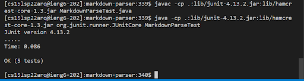

 

- We now put the first two tasks together and run everything in just one command line. You are able to run multiple commands in one line by utilizing the semicolon. By using "" after you call ssh ieng6, the computer will automatically call all commands within the parenthases, output results, and exit the remote account. We also add specificly which java version the computer should be using to compile and run these tests because the computer initially uses an older version that is not compatible with `java` and `javac` commands.
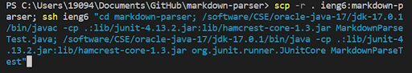

 

- Lastly, here is the output from our all in one command where we copy the markdown-parser repository, switch to the remote computer, change the directory to the markdown-parser repository, compile and run the tester file, and exit the remote account. You will be able to see all files copied as well as the results of the tests.
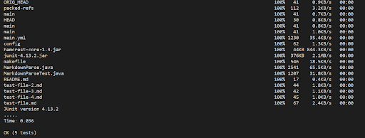