# Lab Report #4: Week 8

[Link to their Markdown Parse Repository](https://github.com/canitry/markdown-parser.git)
 
[Link to my Markdown Parse Repository](https://github.com/Yundukki/markdown-parser)

 

## 1. Snippet #1

 

- This first picture is the test case that I added and used to test my markdown parse using snippet #1. 
    
    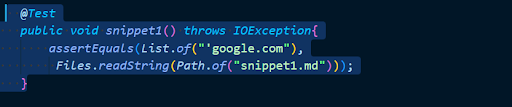

 

- This picture is the output after calling the junit test. The test failed as we expected "'google.com" but were given [].

    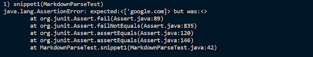

 

- This is a picture of testing snippet #1 through the other persons code that we were given. 

    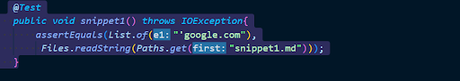

 

- This is the output that was given after calling the junit test.  

    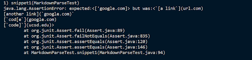

 

Question: Do you think there is a small (<10 lines) code change that will make
your program work for snippet 1 and all related cases that use inline
code with backticks? If yes, describe the code change. If not, describe
why it would be a more involved change.

- I think that it is possible to change a small amount of code for my program to work for snippet 1 and all cases that use inline code with backticks. I would attempt to add a loop that iterates and removes the backticks or skips the backticks in the file before running it through the original markdown parse. 

 

## 2. Snippet #2

 

- This is a picture of the test that I ran against my markdown parse with snippet #2.

    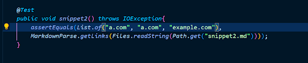

 

- This is a picture of the output after calling the junit test. The test failed as I expected a.com, a.com, example.com but the list returned was empty. 

    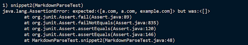

 

- This is a picture of the test that I ran against the other persons markdown parse with snippet #2.

    

 

- This is a picture of the output of the junit test that I ran against the other persons code. 

    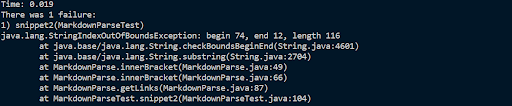

 

Question: Do you think there is a small (<10 lines) code change that will make
your program work for snippet 2 and all related cases that nest
parentheses, brackets, and escaped brackets? If yes, describe the
code change. If not, describe why it would be a more involved change.

    - I think that this would take a more involved change to fix. When initially creating test cases and fixing those errors, I mostly worked with empty spacs and missing brackets. This snippet contains nested brackets and other cases that I have not considered. 

 

## 3. Snippet #3

 

- This is a picture of the test that I ran against the my markdown parse. I expected it to output "https://www.twitter.com", "https://cse.ucsd.edu/".

    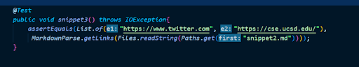
    
 

- This is a picture of the output that was a result of the junit test that I ran against my code. The test failed as it returned an empty list.

    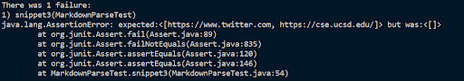

 

- This is a picture of the test that I ran against the other persons markdown parse. 

    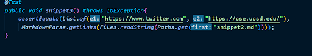

 

- This is a picture of the output of the junit test that I ran against their code.

    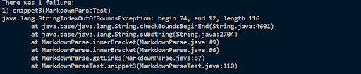

 

Question: Do you think there is a small (<10 lines) code change that will make
your program work for snippet 3 and all related cases that have
newlines in brackets and parentheses? If yes, describe the code
change. If not, describe why it would be a more involved change.

    - I believe that new lines in brackets and parenthases can be fixed with a small change in my markdown parse code. When initially fixing my markdown parse most of my test cases worked with the spacing. I think that I could add an if statement that checks if the line has long empty space, then move to the next line. 