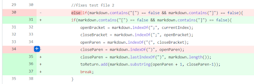
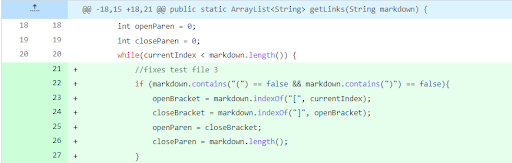
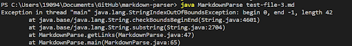
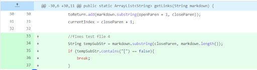
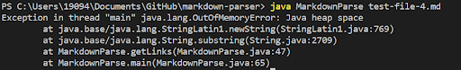

# Lab Report #2: Week 4

1. ### Fix #1: Test File #2

    

    [Link to Test File #2](https://yundukki.github.io/markdown-parser/test-file-2.html)

    

    When adding an extra parenthesis at the end of the link (failure-induced input), it caused the java.lang.OutOfMemoryError (symptom). The bug occurs at `toReturn.add(markdown.substring(openParen + 1, closeParen));`.

2. ### Fix #2: Test File #3

    

    [Link to Test File #3](https://yundukki.github.io/markdown-parser/test-file-3.html)

    

    When removing the parentheses around the link (failure-induced input), it caused the java.lang.StringIndexOutOfBoundsException (sympton). The bug occurs at `toReturn.add(markdown.substring(openParen + 1, closeParen));` but for different reasons than the first. This bug occurs because the index is shifted when we remove both parentheses from the link. 

3. ### Fix #3: Test File #4

    

    [Link to Test File #4](https://yundukki.github.io/markdown-parser/test-file-4.html)

    

    The failure-induced input in this file is the extra empty line added after the last link, which caused the java.lang.OutOfMemoryError (symptom). The bug occurs at `toReturn.add(markdown.substring(openParen + 1, closeParen));`. In this case, the empty line causes the code to continuously search for strings in the empty line.

