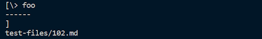
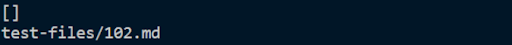
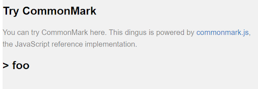
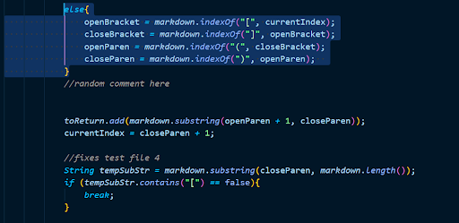
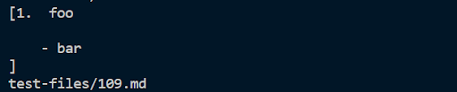
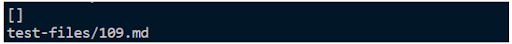
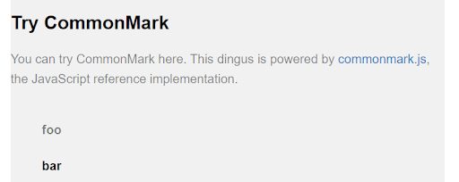
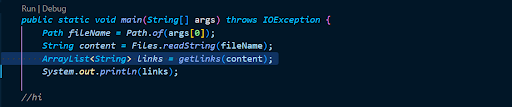

# Lab Report #5: Week 10

### How the difference between results were found

 

First I used `scp -r . ieng6:MARKDOWN-PARSER-MAIN` in the terminal to copy the repository over to the remote computer. I then used vim and added `echo $file` so that when I use the `time bash script.sh` command, it prints out the test file names. I then added the test files and the script.sh file to my own markdown parser and copied that repository over to the remote computer. I used the time bash script.sh command to run both files and compared the results to find two tests that had different results. 

 

## 1. Test File #1
- This is a [link](https://github.com/Yundukki/markdown-parser/blob/main/test-files/102.md) to test file 102 that I used for the first part of this lab report.

- In this test file, when looking at the results, I believe that the my implementation was incorrect and the given implementation was correct. 

     

    

     

- As you can see above, my test output should not have printed anything as there are no links. Below is the screenshot of the given test output in which no links are printed. The expected output should be [] since there are no links within the given test file. 
    
     

    

     

- This picture below is what the given test file should look like according to the CommonMark Demo.

     

    

     

- The bug that is occurring is that if none of the if else statements are true, the code defaults to the else statement which still prints something out regardless of what it is. This means that no matter what is in the test file, unless it is empty, something will be printed out. 

- I think that I would change the highlighted part to an else if statement so that in the case that there are no links found, I can add an else statement that ends the while loop and returns null. Below is a screenshot of the code I would change.

     

    

     

## 2. Test File #2

This is a [link](
https://github.com/Yundukki/markdown-parser/blob/main/test-files/109.md
) to test file 109 that I used for the second part of this lab report.

- In this test file, I believe that again my implementation was incorrect and the given implementation was correct. 

     

    

     

- In the screenshot above, there are characters that were printed that were not links. This shows that implementation is incorrect. Below is the screenshot of the given implementation that I believe is correct. I expect the output to be [] since there are no links in this test file. 

     

    

     

- This picture below is what the given test file should look like according to the CommonMark Demo.

     

    

     

- The bug that is occurring is that my code essentially does not check whether or not the output is a link or not. It is outputting anything that passes the if else statements within my while loop. 

- All links have periods so I could add an if statement that checks if the substring has a period. If not then I would set it to null so that nothing would print out. I would add a for loop that goes through each index of the arraylist and checks if the value contains a period. If it does, then I would continue but if it does not, I would set that value to null. Below is a screenshot where I have highlighted the part of code in which I would implement the solution. 

     

    

     
    

