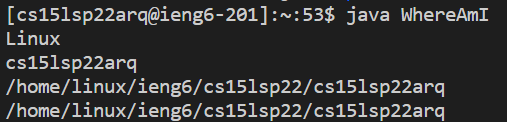

# Lab Report #1: Remote Access

1. ### Installing Visual Studio Code
    
    a. To begin, we will first head to the [Visual Studio Code](https://code.visualstudio.com/) Website. Select MacOS, Windows x64, or Linux x64 for your respective operating system.

    

2. ### Remotely Connecting

    (Windows Only) Start by installing [OpenSSH](https://docs.microsoft.com/en-us/windows-server/administration/openssh/openssh_install_firstuse).

    Next, we will look up our [Course-specific Account](https://sdacs.ucsd.edu/~icc/index.php). Here you will enter your credentials and find your course-specific account under Additional Accounts.

     

    To set up remote connection, head to VS Code and open a new terminal (Terminal -> New Terminal). 
        
    Enter the Command (zz will be replaced by your course-specific account)
        
    `$ssh cs15lsp22zz@ieng6.ucsd.edu`

    If it is your first time logging, you may be prompted to a question in which you answer yes and enter your password. 

    After doing so, your terminal should look like this:

    

    You are now successfully connected! Your computer is now called the _client_ and the remote computer is called the _server_.

3. ### Testing Commands while Remotely Connected

    
    A few commands you could try are:

    * `ls -lat`

        This command combines three options in one. -l shows all of the hidden files. -a shows additional information. -t shows all of the files and information sorted by time and date of when they were created/modified. 

    

    * `ls -a`
        
        This command searches the current directory and shows additional information of all the files.

    Example Command:

    

    As we can see here, the command attempts to access another students files from their directory. The server does not allow this so the request is denied. 

    Using the command `exit` or CTRL-D will log you out of the server. 

4. ### Moving Files Using scp

    In this part, we will learn how to copy a file from our computer to the remotely connected computer. 

    First want to create a file on the client computer. In this case, we will use the file WhereAmI.java. Make sure to copy the code in the image below!

    

    Test this file to ensure it works using java and javac. If you do not have java installed, you may skip this step.

    Follow the command below to copy over the file into the server (remotely connected computer)

    

    We will now long into the server using SSH to ensure that our file successfully copied over. 

    Use the commmand ls to check if the file exists in the directory. 

    

    Regardless of whether or not you have java downloaded, you should be able to run the file inside the server as java is downloaded on the remote computer.

     
    

5. ### Setting a SSH Key

    Moving between client and server is extremely time consuming when done repeatedly. To hasten this process we can create a ssh key.

    We start by calling `ssh-keygen` on the client 

    

    Press enter and it will prompt you for a passphrase in which you will leave blank for no passphrase. 
        
    If you are using windows, follow the extra steps given below.

   [Windows SSH KeyGen](https://docs.microsoft.com/en-us/windows-server/administration/openssh/openssh_keymanagement#user-key-generation)
    
    Lastly we need to copy the public key from the directory of the 
    client to the user account on the server. Login to the server and 
    use the following command:

    `mkdir .ssh`

    Now return back to the client and use the following command:

    

    Make sure to replace the zz with your course-specific account. (in this case replace "arq")

6. ### Optimize Remote Running

    Here are some tips to make switching between client and server easier:

    * Using the command `ssh cs15lsp22zz@ieng6.ucsd.edu "ls"` will allow you to switch from client to server and print the current working directory in the remote computer. 

    

    * While we solved the problem of having to type our password each time we switch from client to server, it still takes time to type out the ssh command with your course specific account. Using the up arrow to recall past commands is a fast way to fix this time-consuming issue. 

    * Instead of running one command at a time, we can use semicolons to run multiple commands at once. 

    

    The computer was able to copy, compile and run the commands in one line rather than us typing each command and having the computer run it one by one. While it does seem like little time is saved, in longer programs it is much faster to call all commands at once. 